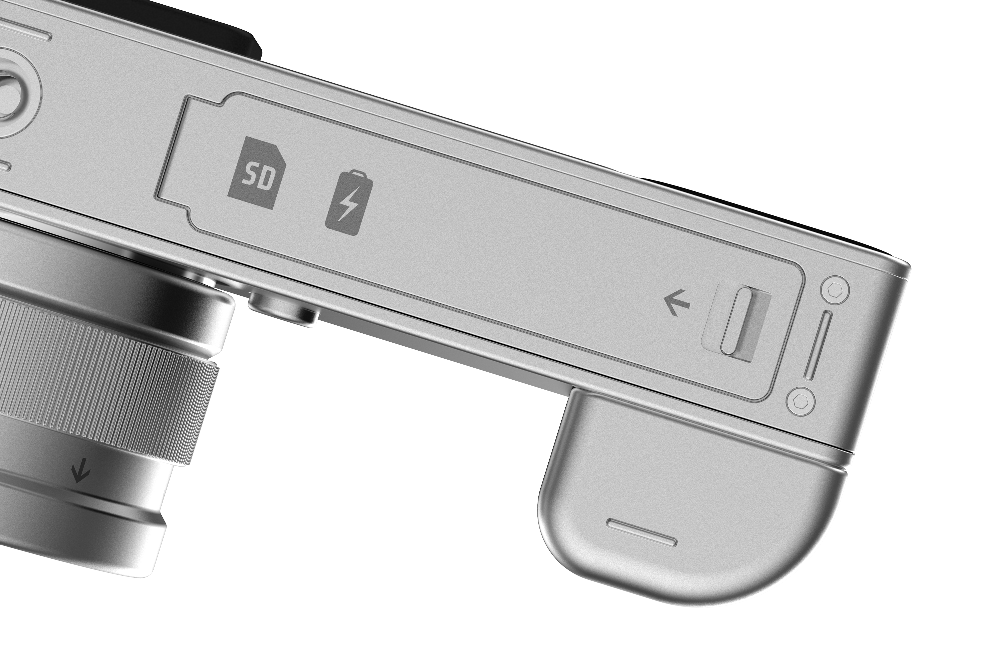
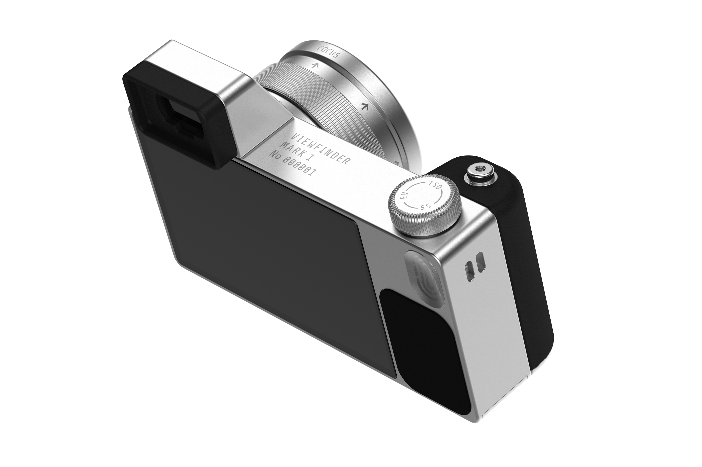

    <h4 class="project-sub-title">
        UI
    </h4>
    <h4 class="project-description">
        With this project I took the oppertunity to envision how the UI and hardware could be seamlessly brought together to deliver a more holistic package.
    </h4>

    <h4 class="project-sub-title">
        Illustrations
    </h4>
    <h4 class="project-description">
        I illustrated the orthaganol views of the camera to help with menu systems within the systems UI, and also to be used to help communicate interactions with the dial and lens ring.
    </h4>

    <h4 class="project-sub-title">
        UI
    </h4>
    <h4 class="project-description">
        With this project I took the oppertunity to envision how the UI and hardware could be seamlessly brought together to deliver a more holistic package.
    </h4>

<!--  -->

