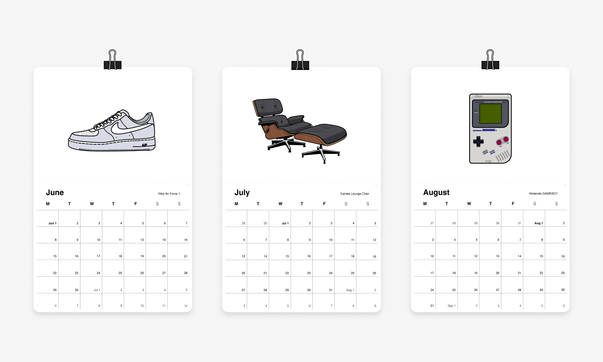
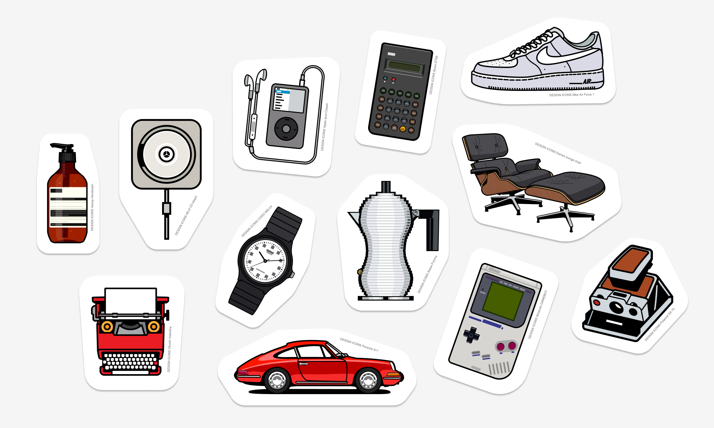

    <h4 class="project-sub-title">
        This project pays tribute to some designs that I think are pretty iconic.
    </h4>
    <h4 class="project-description">
       I've tried to distill each objects form down into a style that's bold, simple, and captures each object by their core visual elements. With objects ranging from Aesop handwash to the Porsche 911.
    </h4>

    <h4 class="project-sub-title">
        Merch
    </h4>
    <h4 class="project-description">
       I auctioned off a calendar that included the icons for the Microsoft Give auction, which is a yearly event that raises money for charity. Stickers are also in the works. 
    </h4>

