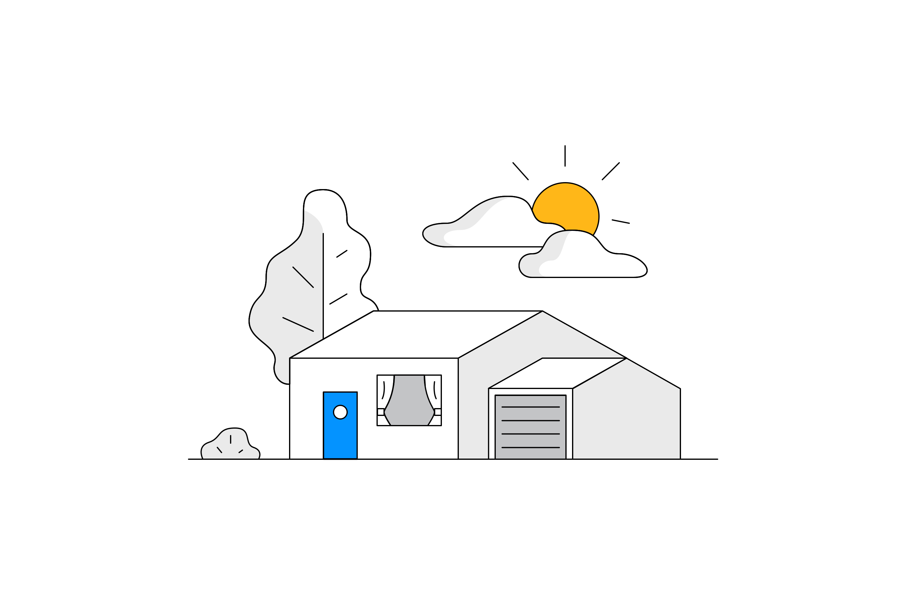
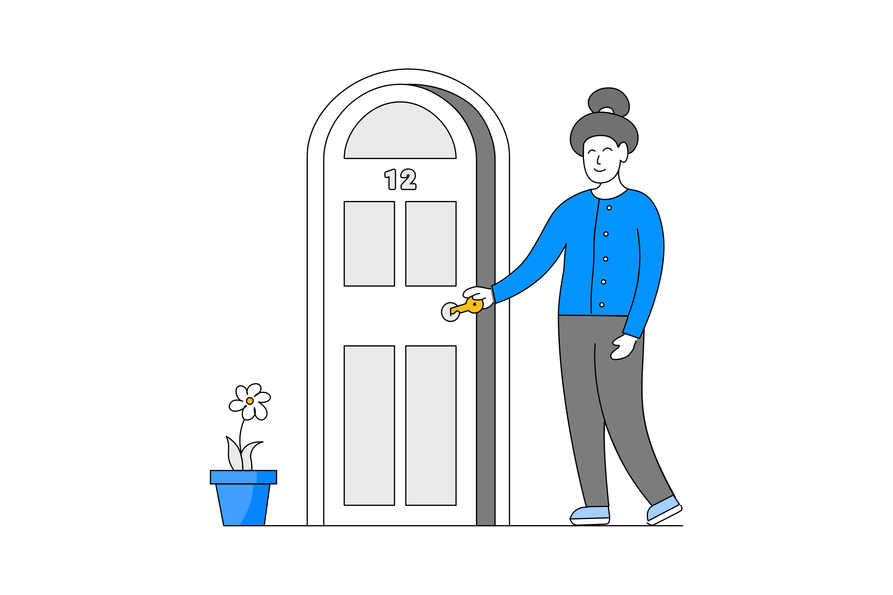
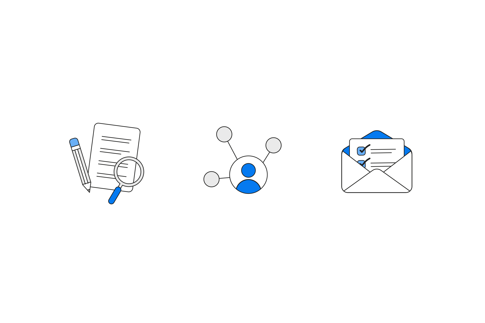

    <h4 class="project-sub-title">
        Branding
    </h4>
    <h4 class="project-description">
        Micasa's mission statement is 'to help people keep their home in shape'. Following this, I started to play off shapes that included metaphors for the home and health, incorporating them in as many ways as I could. You can see some of those explorations here. 
    </h4>

    <h4 class="project-sub-title">
        Illustrations
    </h4>
    <h4 class="project-description">
        Owning a home is a pretty daunting task, one which can come with a lot of complexity. With the illustrations, I wanted to execute a style that was simple and approachable. 
    </h4>

    <h4 class="project-sub-title">
        Home pages
    </h4>
    <h4 class="project-description">
        There are two audiences for Micasa, and two faces of the product to meet those audiences. The Home owners center, and the Agents center. One of the most important parts of this project was to bring people into the platform and encourage them to sign up - especially important with a product still in it's infancy. 
    </h4>

