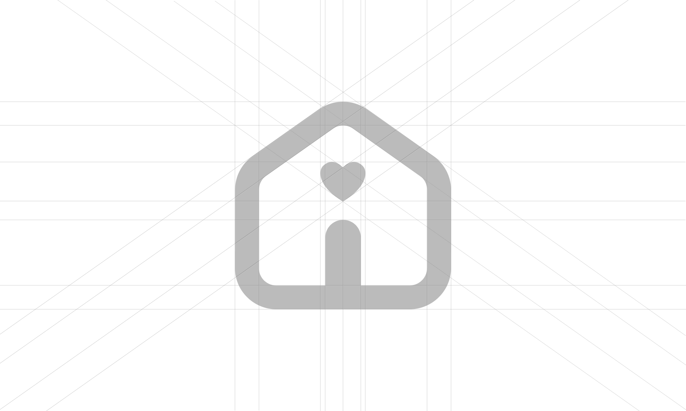
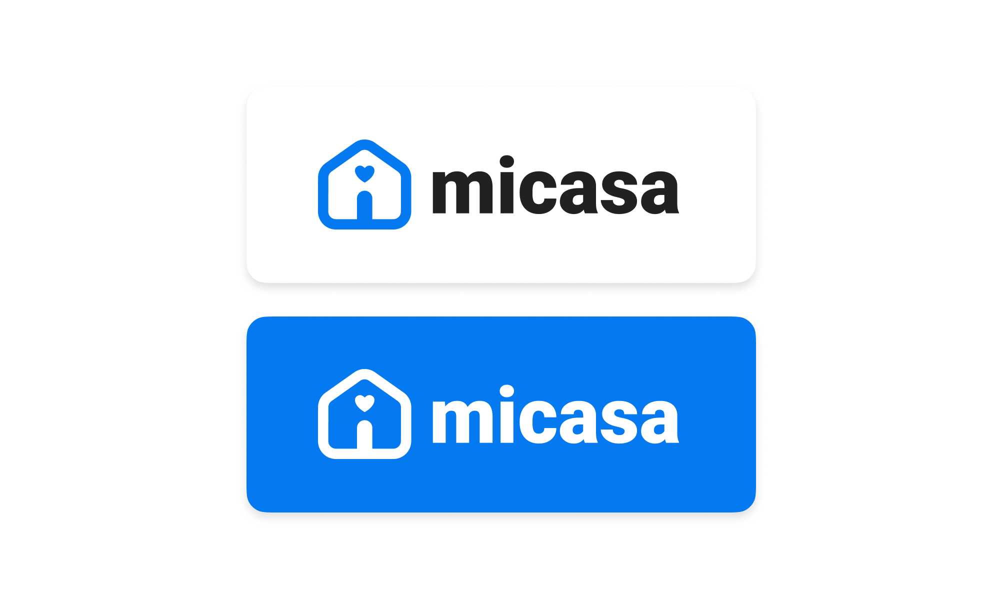
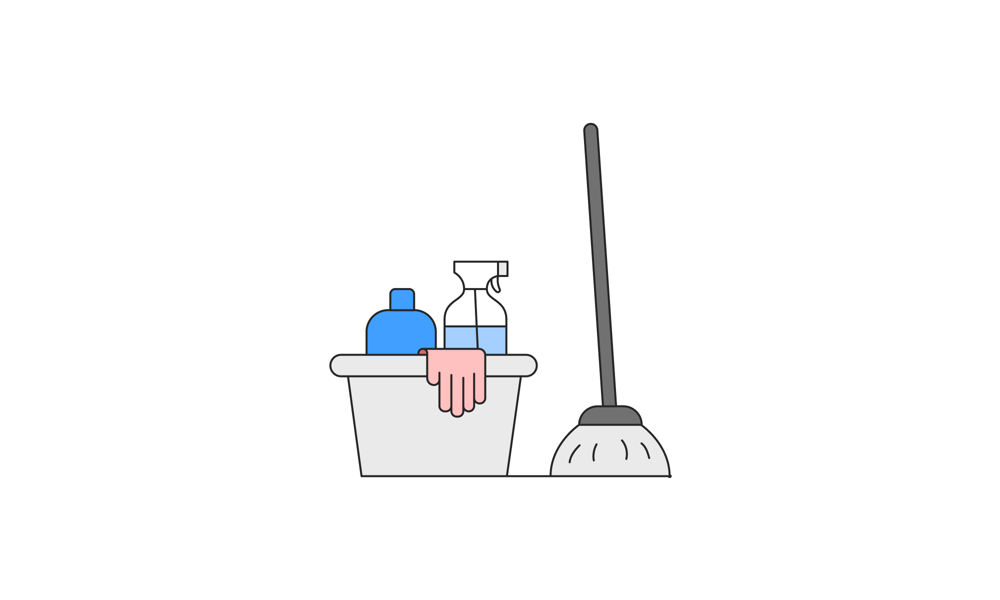
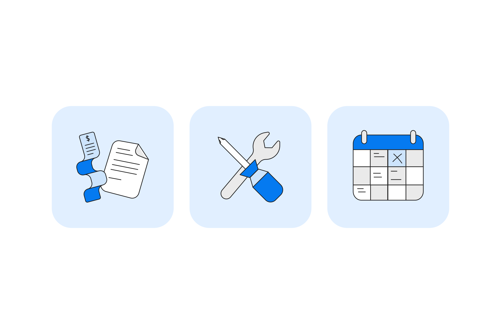
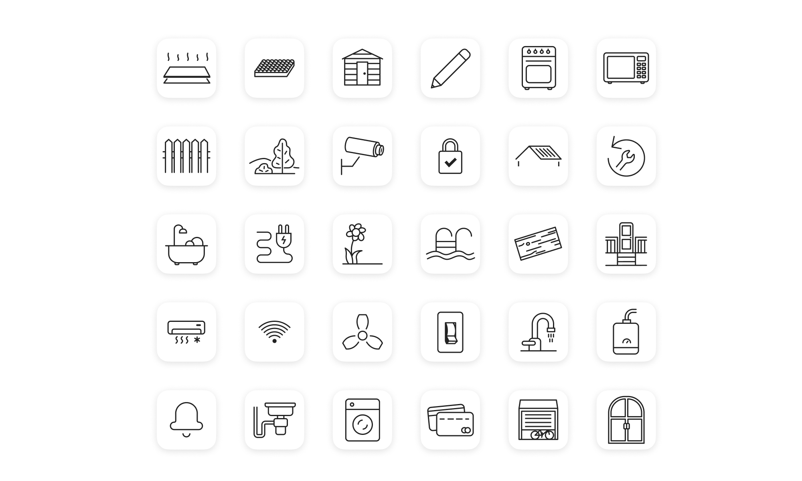
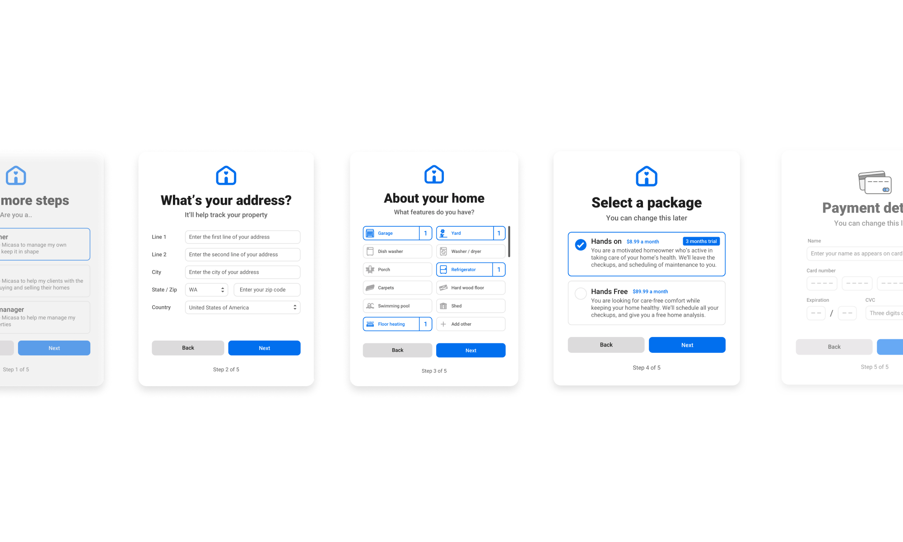
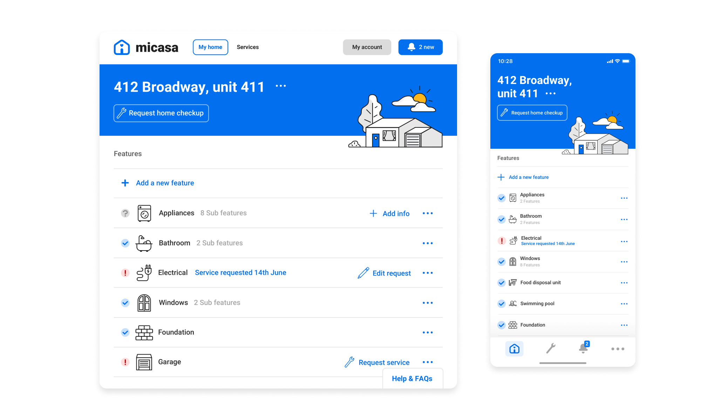
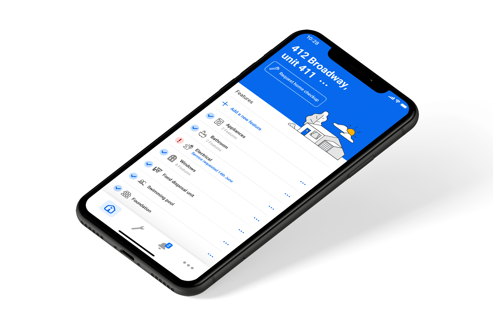

    <h4 class="project-sub-title">
        Micasa is service that helps you manage your home. I was the sole designer asked to deliver branding, illustrations, iconography, UX and UI.
    </h4>
    <h4 class="project-description">
        The product is focused on the goal of helping home-owners keep their homes maintained. On their own, or by being connected to agents through the platform. Owning a home is no simple task - Micasa's goal is to make this simpler.
    </h4>

    <h4 class="project-sub-title">
        Branding
    </h4>
    <h4 class="project-description">
        Micasa's mission is to help people keep their home in shape. Following this, for the branding I started to play off shapes that included metaphors for the home and health, incorporating them in as many ways as I could. You can see a couple of these explorations here, and the final brand and word mark are further below.
    </h4>

    <h4 class="project-sub-title">
        Illustrations
    </h4>
    <h4 class="project-description">
        Owning a home is a pretty daunting task, one which can come with a lot of complexity. With illustration I aimed to make the task seem more approachable with a simple and clean style. 
    </h4>

    <h4 class="project-sub-title">
        Icon set
    </h4>
    <h4 class="project-description">
        Micasa allows users to keep track of the maintenence history of users home features. To complement this in the product, we designed a library of icons that could be used to visually complement the experience.
    </h4>

    <h4 class="project-sub-title">
        Home pages
    </h4>
    <h4 class="project-description">
        There are two audiences for Micasa, and two faces of the product to meet those audiences. The Home owners center, and the Agents center. One of the most important parts of this project was to bring people into the platform and encourage them to sign up - especially important with a product still in it's infancy. 
    </h4>

    <h4 class="project-sub-title">
        Onboarding
    </h4>
    <h4 class="project-description">
        Through onboarding we aimed to gain more insight about the user to best get them set up with the service. Encouraging the initial set up of features that they would like to track in their home. 
    </h4>

    <h4 class="project-sub-title">
        Home-owner center
    </h4>
    <h4 class="project-description">
        There are two audiences for Micasa, and two faces of the product to meet those audiences. The Home owners center, and the Agents center. One of the most important parts of this project was to bring people into the platform and encourage them to sign up - especially important with a product still in it's infancy. 
    </h4>

