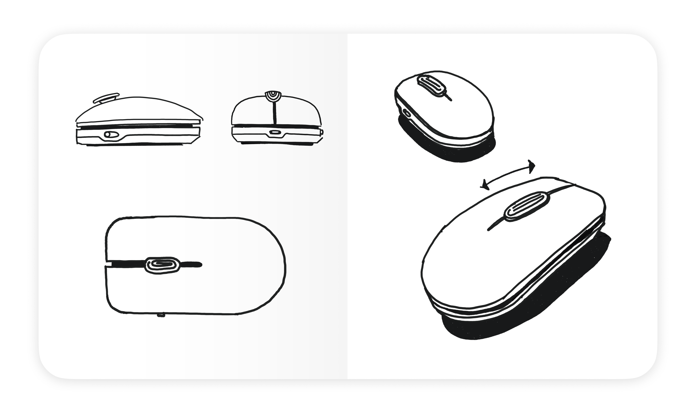
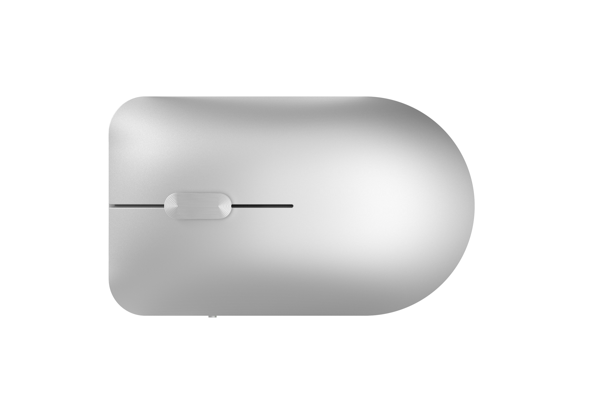
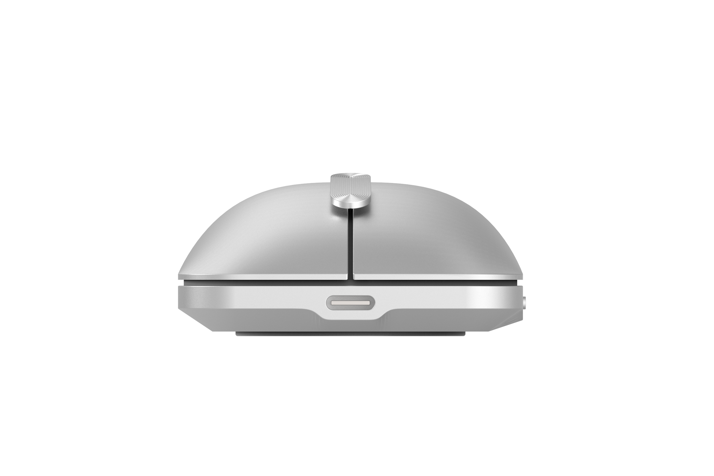
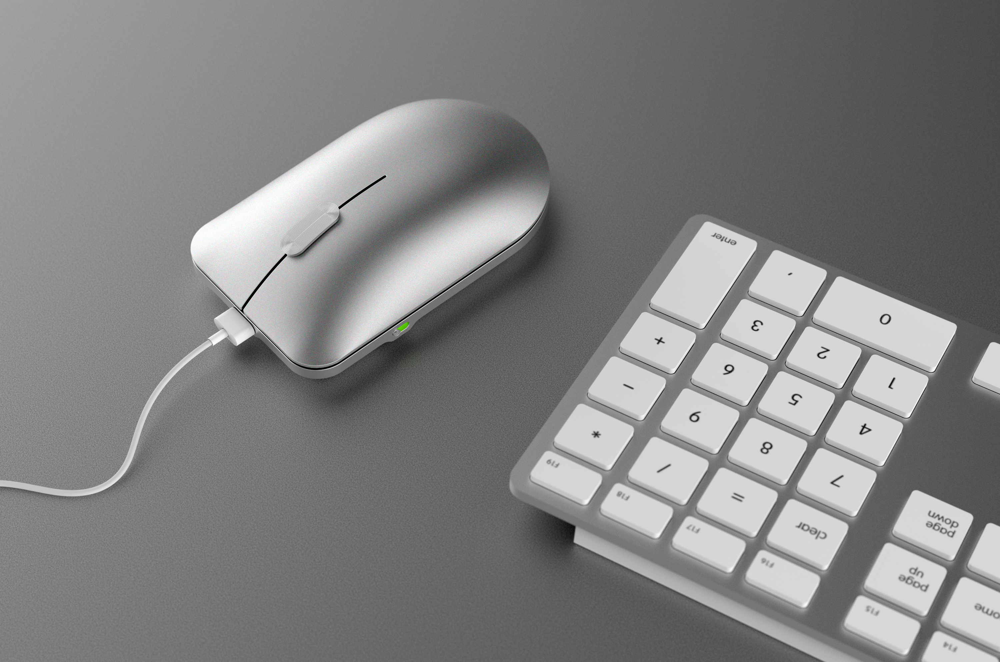
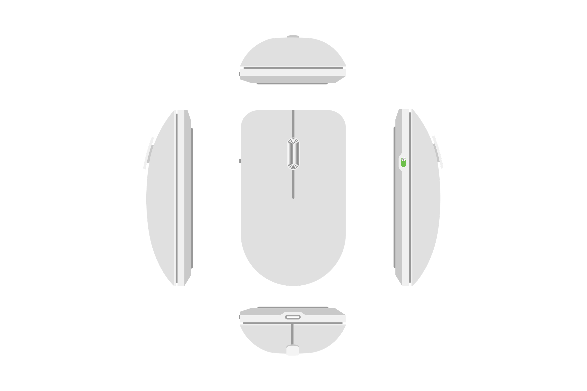
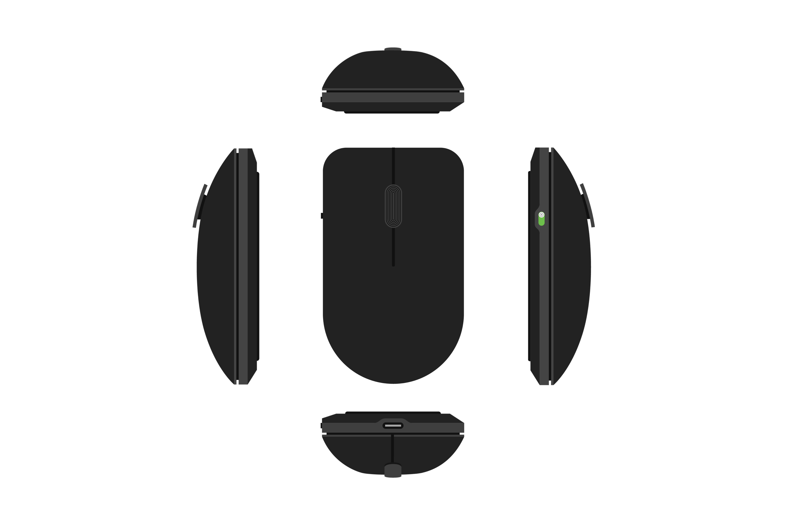
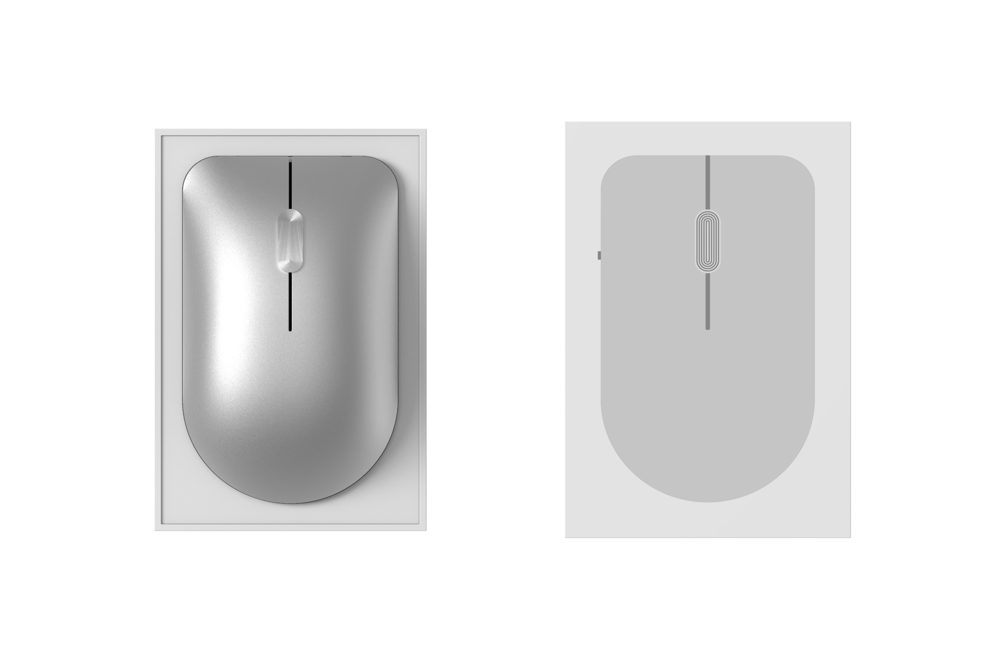
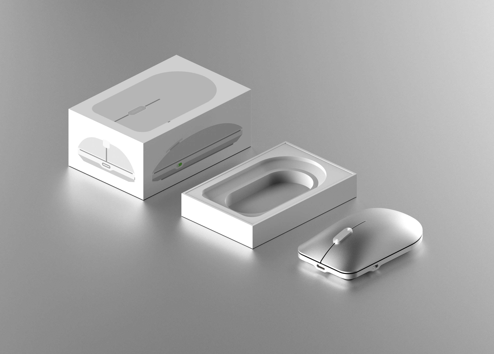

    <h4 class="project-sub-title">
        A design for a mouse concept.
    </h4>
    <h4 class="project-description">
       How many times does the average person click on their computer mouse a day? How many pixels do they move across their screen? How far do they scroll? Our computer mice get used a hell of a lot. Acknowledging this, I couldn't help but recognize a huge opportunity for impact. If you can make any type of small incremental improvement to a computer mouse, it would equal a huge amount of value over it's lifetime of use.
    </h4>

    <h4 class="project-sub-title">
        Scroll behaviour
    </h4>
    <h4 class="project-description">
       Think of the scroll behaviour of the mouse as a joystick restricted to just one plane of movement. This approach means that to scroll long distances on screen the user doesn't need to flick the scroll wheel continuously, but would rather be able to keep their finger holding forwards until they reach the point in the page they want - At which point they can just let go. 
    </h4>

    <h4 class="project-sub-title">
        Illustrations
    </h4>
    <h4 class="project-description">
        To help with packaging, and to help map out some of the interactions that I was imagining around the scroll behaviour, i recreated the profiles of the mouse in it's light and dark variants.
    </h4>

    <h4 class="project-sub-title">
        Packaging
    </h4>
    <h4 class="project-description">
        I wanted to try my hand at designing some packaging to complete the project, leveraging the illustrations created previously to give a glimpse at the product before opening. 
    </h4>

