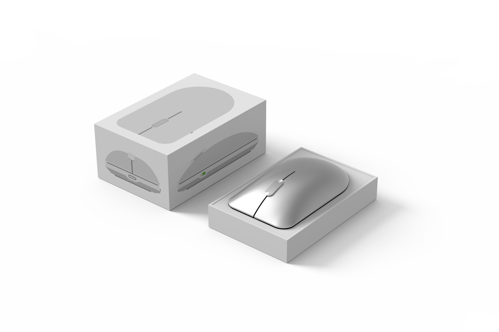

    <h4 class="project-sub-title">
        Illustrations
    </h4>
    <h4 class="project-description">
        To help with packaging, and to help map out some of the interactions that I was imagining around the scroll behaviour, i recreated the profiles of the mouse in it's light and dark variants.
    </h4>

    <h4 class="project-sub-title">
        Illustrations
    </h4>
    <h4 class="project-description">
        Owning a home is a pretty daunting task, one which can come with a lot of complexity. With the illustrations, I wanted to execute a style that was simple and approachable. 
    </h4>

