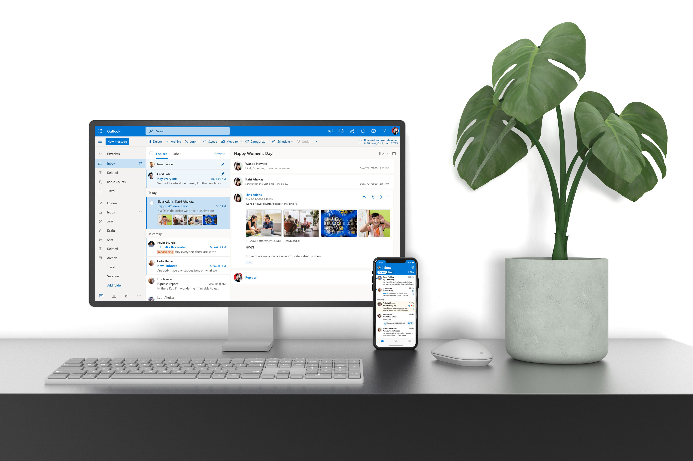
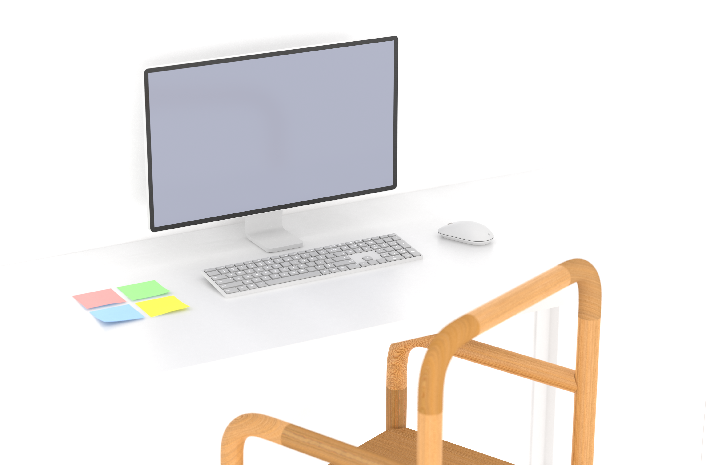

    <h4 class="project-sub-title">
        For our hack week at microsoft, I wanted to spend some time learning more about rendering. I decided to spend a week creating models, and rendering out different scenes that could be used to surface different UI across our endpoints.  
    </h4>
    <h4 class="project-description">
        The following images are the results of those experiments. The images are being used in future marketing explorations, and have been incorporated into the teams assets to use when presenting features. 
    </h4>

    <h4 class="project-sub-title">
        Loading Animation
    </h4>
    <h4 class="project-description">
        After wanting to learn more about animation, I took it upon myself to explore how we might create a loading animation for Outlook. Motion has the amazing ability to change perception of time. With this, I was aiming to make the app feel more agile on boot. 
    </h4>

